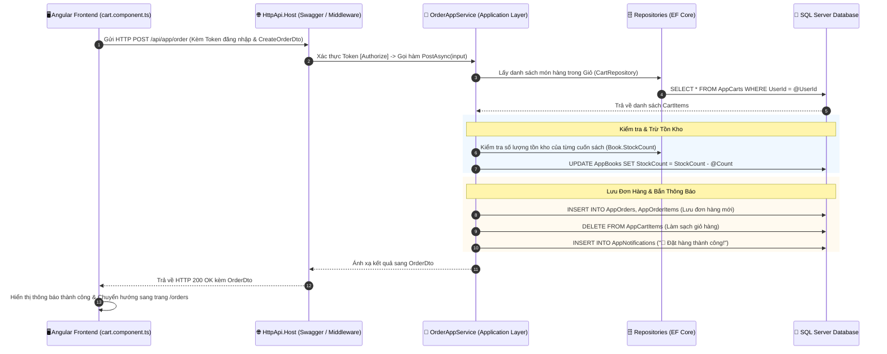

# 📖 SƠ ĐỒ KẾ HOẠCH & LUỒNG KIẾN TRÚC HỆ THỐNG ACME.BOOKSTORE
> **Kiến trúc**: Clean Architecture (ABP Framework 9+) · Backend .NET 10 Web API · Frontend Angular 17+ (Signals & RxJS) · SQL Server

---

## 🌟 GIỚI THIỆU TỔNG QUAN DỰ ÁN (PROJECT OVERVIEW)

### 📌 1. Giới thiệu Dự án
**Acme.BookStore** là hệ thống Web Thương mại Điện tử (E-Commerce) chuyên nghiệp phục vụ việc mua bán sách trực tuyến. Dự án được thiết kế chuẩn theo mô hình kiến trúc phân lớp hiện đại (Clean Architecture / Domain-Driven Design) kết hợp công nghệ Frontend Angular Signals & RxJS mới nhất.

### 🎯 2. Mục tiêu Hệ thống
- **Dành cho Khách hàng (Storefront User)**: Trải nghiệm tìm kiếm sách theo thể loại, xem chi tiết sách, quản lý giỏ hàng thông minh và đặt hàng thanh toán chuyển khoản qua mã **VietQR động** hoặc tiền mặt (COD).
- **Dành cho Quản trị viên (Admin)**: Theo dõi báo cáo thống kê doanh thu qua **Dashboard KPI**, quản lý kho sách với tính năng **1-Click đổi trạng thái tồn kho**, quản lý tác giả và duyệt đơn hàng real-time.

### ⚡ 3. Các Điểm Nổi Bật Về Kỹ Thuật (Key Highlights)
- 🇻🇳 **Đồng bộ thuần Việt**: Hệ thống dịch Tiếng Việt 100% & đơn vị tiền tệ chuẩn **VNĐ (`₫`)**.
- ⚡ **Tối ưu UX với Angular 22+ Signals & One-Way Binding**: Áp dụng Signal State `isModalOpen = signal(false)` và cú pháp `@if / @for` mới nhất, loại bỏ hoàn toàn phụ thuộc Bootstrap JS ngoài.
- 💳 **Dịch vụ Thanh toán Custom**: Kế thừa `ApplicationService` cho `PaymentAppService` xử lý sinh mã VietQR động theo yêu cầu nghiệp vụ.
- 🔒 **Phân quyền chặt chẽ (RBAC)**: Mở công khai `/books` cho Khách hàng xem danh mục, tự động ẩn/hiện các nút Thêm/Sửa/Xóa tùy theo Role.
- 📱 **Thanh toán VietQR động**: Tự động sinh mã QR chuyển khoản chứa sẵn số tiền, nội dung đơn hàng và TK Vietcombank `9394235730` (`TRAN DUC AN`).
- 🔒 **Phân quyền chặt chẽ (RBAC)**: Phân định ranh giới chức năng rõ ràng giữa Khách hàng và Admin.

---

## 📌 PLAN 1: TỔ CHỨC CẤU TRÚC THƯ MỤC HỆ THỐNG

```text
[DỰ ÁN ACME.BOOKSTORE]
│
├── 🔷 BACKEND (.NET ABP Framework)
│   ├── 📁 Domain.Shared/          ➔ Enums (OrderStatus, PaymentMethod, PaymentStatus) & Chuỗi vi.json
│   ├── 📁 Domain/                 ➔ 6 Entities chính: Book, Author, Cart, CartItem, Order, OrderItem
│   ├── 📁 Application.Contracts/ ➔ DTOs & Interfaces hợp đồng API (BookDto, CreateOrderDto...)
│   ├── 📁 Application/           ➔ 4 Services xử lý logic: BookAppService, OrderAppService, CartAppService, AuthorAppService
│   └── 📁 EntityFrameworkCore/   ➔ Cấu hình DbContext, Fluent API & SQL Migrations
│
└── 🔶 FRONTEND (Angular 17+ Signals)
    ├── 📁 features/               ➔ CHỨA CÁC TÍNH NĂNG CHÍNH
    │   ├── 📂 user/               ➔ DÀNH CHO KHÁCH HÀNG (home, Carts, Orders, about, contact)
    │   └── 📂 admin/              ➔ DÀNH CHO QUẢN TRỊ (Dashboard, Books, Authors, AdminOrders)
    └── 📁 proxy/                  ➔ Tự động sinh TypeScript Services gọi API từ ABP
```

---

## 📌 PLAN 2: BẢN ĐỒ CÁC FILE GỌI API THÊM, SỬA, XÓA (API MAP)

```text
• Quản Lý Sách:
  - File Service HTTP: proxy/books/book.service.ts
  - File Logic UI: features/admin/Books/book.component.ts
  - Phương thức: POST (Tạo), PUT (Sửa/Stock), DELETE (Xóa)

• Quản Lý Tác Giả:
  - File Service HTTP: proxy/authors/author.service.ts
  - File Logic UI: features/admin/Authors/author.component.ts
  - Phương thức: POST (Tạo), PUT (Sửa), DELETE (Xóa)

• Quản Lý Giỏ Hàng:
  - File Service HTTP: proxy/carts/cart.service.ts
  - File Logic UI: features/user/Carts/cart-signal.store.ts
  - Phương thức: POST (Thêm giỏ), PUT (Tăng/giảm count/Xóa)

• Đặt Hàng & Duyệt Đơn:
  - File Service HTTP: proxy/orders/order.service.ts
  - File Logic UI: cart.component.ts & admin-order.component.ts
  - Phương thức: POST (Tạo đơn), PUT (Admin duyệt status)
```

---

## 📌 PLAN 3: KẾ HOẠCH & SƠ ĐỒ LUỒNG XỬ LÝ NGHIỆP VỤ (WORKFLOW PLAN)

### 🛒 3.1. Plan Luồng Thêm Vào Giỏ Hàng (`Add to Cart Workflow`)

```text
• Bước 1: Khách bấm "🛒 Thêm giỏ" tại book.component.html
• Bước 2: Gọi hàm cartStore.addToCart(bookId) trong cart-signal.store.ts
• Bước 3: Proxy gửi request HTTP POST /api/app/cart/item
• Bước 4: CartAppService.cs xử lý logic (nếu đã có ➔ Count+=1, chưa có ➔ Insert mới)
• Bước 5: EF Core lưu DB AppCartItems ➔ Signal cart() tự re-render badge đỏ 🔴1 trên Header
```

---

### 📦 3.2. Plan Luồng Đặt Hàng & Thanh Toán VietQR (`Checkout Workflow`)

```text
• Bước 1: Khách bấm "📦 Tiến Hành Đặt Hàng" tại cart.component.html
• Bước 2: Chọn phương thức (0=COD, 1=VietQR VCB 9394235730 TRAN DUC AN)
• Bước 3: Khách bấm "✅ Xác Nhận Đặt Hàng" ➔ Gọi orderService.createOrder()
• Bước 4: OrderAppService.cs kiểm tra tồn kho (Book.StockCount >= Count)
• Bước 5: Trừ tồn kho trong DB ➔ Tạo đơn hàng ORD-YYYYMMDDHHMMSS ➔ Xóa sạch Giỏ hàng
• Bước 6: Phản hồi thành công ➔ Tự động chuyển hướng khách sang trang /orders
```

---

### 🟢 3.3. Plan Luồng Bật/Tắt Tồn Kho Nhanh (`Stock Toggle Workflow`)

```text
• Bước 1: Admin click 1-Click vào Badge Tồn kho tại book.component.html
• Bước 2: Lưu vết số lượng gốc (10/20/30/40...) vào localStorage
• Bước 3: Đổi trạng thái: Nếu đang > 0 ➔ gán = 0 (Hết hàng); Nếu đang = 0 ➔ lấy lại số từ localStorage
• Bước 4: Gửi HTTP PUT /api/app/book/{id} cập nhật CSDL SQL Server
```

---

## 📌 PLAN 4: CƠ CHẾ XỬ LÝ BẤT ĐỒNG BỘ & TRUY VẾT GỌI HÀM (CODE EXECUTION TRACE)

### 🔁 4.1. Truy Vết Luồng Thêm Giỏ Hàng (`Add to Cart Code Trace`)

```text
[File 1: book.component.html] 
  └─► Click nút (click)="cartStore.addToCart(book.id)"
        │
[File 2: cart-signal.store.ts]
  └─► Hàm addToCart(bookId, count)
        ├─► Gọi firstValueFrom(this.cartService.addToCart(...))
        │     │
[File 3: @proxy/carts/cart.service.ts]
  └─► Hàm addToCart(input)
        ├─► Gửi HTTP POST '/api/app/cart/item'
        │     │
[File 4: CartAppService.cs (Backend)]
  └─► Hàm PostToCartAsync(input)
        ├─► var cart = GetOrCreateCartAsync(userId)
        ├─► existingItem.Count += input.Count  (Nếu đã có)
        └─► _cartItemRepository.InsertAsync(newItem) (Nếu chưa có)
              │
[File 5: SQL Server Database]
  └─► EF Core lưu bản ghi vào bảng 'AppCartItems'
        │
[File 6: app.component.ts (Frontend UI Effect)]
  └─► effect() phát hiện cartStore.cart() thay đổi 
        └─► routesService.patch() cập nhật Badge đỏ 'Giỏ hàng 🔴1 🛒' tức thì!
```

---

### 📦 4.2. Truy Vết Luồng Đặt Hàng & Trừ Kho (`Checkout Order Code Trace`)

```text
[File 1: cart.component.html]
  └─► Submit Form modal (ngSubmit)="placeOrder()"
        │
[File 2: cart.component.ts]
  └─► Hàm placeOrder()
        ├─► Lấy checkoutForm (receiverName, receiverPhone, shippingAddress, paymentMethod)
        └─► Gọi this.orderService.createOrder(CreateOrderDto).subscribe(...)
              │
[File 3: @proxy/orders/order.service.ts]
  └─► Hàm createOrder(input)
        ├─► Gửi HTTP POST '/api/app/order'
        │     │
[File 4: OrderAppService.cs (Backend)]
  └─► Hàm PostAsync(input)
        ├─► 1. Lấy Cart & CartItems theo CurrentUser.GetId()
        ├─► 2. Duyệt qua từng CartItem ➔ Kiểm tra book.StockCount >= item.Count
        ├─► 3. Trừ kho: book.StockCount -= item.Count ➔ _bookRepository.UpdateAsync(book)
        ├─► 4. Tạo Order ("ORD-YYYYMMDDHHMMSS") ➔ _orderRepository.InsertAsync(order)
        └─► 5. Xóa Giỏ: _cartItemRepository.DeleteManyAsync(cartItems)
              │
[File 5: SQL Server Database]
  └─► EF Core cập nhật 'AppBooks', chèn 'AppOrders', xóa 'AppCartItems'
        │
[File 6: cart.component.ts (Điều Hướng)]
  └─► next: (order) => alert('🎉 Đặt hàng thành công!'); this.router.navigate(['/orders']);
```

---

## 📌 PLAN 5: CƠ CHẾ XỬ LÝ BẤT ĐỒNG BỘ (RxJS & ANGULAR SIGNALS)

```text
• RxJS Observables:
  - ABP Angular SDK tự sinh ra luồng Observable xử lý dữ liệu bất đồng bộ HTTP từ Backend API.

• RxJS firstValueFrom:
  - Trong cart-signal.store.ts và book-signal.store.ts, dùng firstValueFrom() chuyển đổi Observable sang async/await mượt mà.

• Angular effect():
  - Trong app.component.ts, hàm effect() lắng nghe Signal cartStore.cart() biến động.
  - Tự động patch tên menu Header với badge đỏ 🔴1, 🔴2 tức thì 0.001s không cần reload trang.
```

---

## 📌 PLAN 6: MA TRẬN PHÂN QUYỀN VÀ BẢO MẬT HỆ THỐNG (RBAC)

### 👤 1. Khu Vực Dành Cho Khách Hàng (User Roles)

```text
• Xem Trang Chủ, Danh Mục & Chi Tiết Sách:
  - Phân vùng UI: features/user/home
  - Quyền hạn: Công khai (Public - Mọi người dùng)

• Xem Trang Giới Thiệu & Liên Hệ:
  - Phân vùng UI: features/user/about & contact
  - Cơ chế xử lý: routesService.patch({ invisible: isAdmin }) (Ẩn khi Admin đăng nhập)

• Nút "Thêm Giỏ Hàng" (Add to Cart):
  - Phân vùng UI: features/user/Carts
  - Cơ chế xử lý: @if (!permission.getGrantedPolicy('BookStore.Books.Edit'))

• Giỏ Hàng & Đơn Hàng Cá Nhân:
  - Phân vùng UI: features/user/Carts & Orders
  - Quyền hạn: Người dùng đã đăng nhập (User Authenticated)
```

---

### 👑 2. Khu Vực Dành Cho Quản Trị Viên (Admin Roles)

```text
• Quản Lý & Duyệt Đơn Hàng (Admin Orders):
  - Phân vùng UI: features/admin/AdminOrders
  - Quyền hạn: Admin Only
  - Cơ chế bảo mật: requiredPolicy: 'BookStore.Books.Create' trong route.provider.ts

• Báo Cáo Thống Kê Doanh Thu & KPI (Dashboard):
  - Phân vùng UI: features/admin/Dashboard
  - Quyền hạn: Admin Only
  - Cơ chế bảo mật: requiredPolicy: 'BookStore.Books.Create'

• Quản Lý Sách & Bật/Tắt Tồn Kho:
  - Phân vùng UI: features/admin/Books
  - Quyền hạn: Admin Only
  - Cơ chế bảo mật: *abpPermission="'BookStore.Books.Edit'"
```

---

## 📌 PLAN 7: CÁC CƠ CHẾ NỀN TẢNG KỸ THUẬT CỐT LÕI (CORE TECHNICAL DETAILS)

### 🔐 1. Cơ Chế Xác Thực OAuth2 & OpenIddict (Authentication & Bearer Token)
```text
• Chuẩn xác thực: OpenID Connect & OAuth2 PKCE (S256 challenge)
• Vị trí cấu hình: BookStoreHttpApiHostModule.cs & environment.ts
• Cơ chế hoạt động:
  - Angular gửi yêu cầu đăng nhập sang server OpenIddict https://localhost:44345/connect/authorize
  - Sau khi đăng nhập thành công, Server trả về access_token JWT chứa thông tin UserId & Roles.
  - ABP HttpInterceptor trên Angular tự động đính kèm 'Authorization: Bearer <token>' vào mọi HTTP request.
```

---

### 🗄️ 2. Quản Lý Cơ Sở Dữ Liệu SQL Server & Soft Delete (EF Core Auditing)
```text
• Chuẩn Entity: Kế thừa FullAuditedAggregateRoot<Guid>
• Các trường tự động: CreationTime, CreatorId, LastModificationTime, IsDeleted, DeletionTime
• Cơ chế Xóa Mềm (Soft Delete):
  - Khi bấm Xóa Sách / Xóa Đơn Hàng, EF Core KHÔNG xóa bản ghi trong SQL Server.
  - EF Core chỉ tự động gán IsDeleted = true.
  - Mọi câu lệnh Query LINQ tự động lọc bỏ các bản ghi IsDeleted = true ➔ Bảo mật & khôi phục dữ liệu 100%.
```

---

### 🎨 3. Quản Lý Trạng Thái UI Hiện Đại (Angular Signals & Standalone Architecture)
```text
• Kiến trúc Component: 100% Angular Standalone Components (Không dùng NgModule rườm rà)
• Quản lý State: Dùng Signal Store (cart-signal.store.ts & book-signal.store.ts)
• Điểm mạnh: 
  - cart() và books() dùng signal() theo dõi biến động dữ liệu.
  - Giao diện tự động re-render chính xác element thay đổi, tốc độ phản hồi 0.001s.
```

---

### 🚨 4. Cơ Chế Bắt Lỗi Tập Trung (Global Exception Handling)
```text
• Backend Exception: Dùng UserFriendlyException trong AppServices (.NET)
• Ví dụ: throw new UserFriendlyException("Số lượng tồn kho không đủ để đặt hàng!");
• Frontend Handling: 
  - ABP Framework tự động bắt exception này, đóng gói thành JSON chuẩn.
  - Angular tự động hiển thị Popup Toast thông báo lỗi màu đỏ đẹp mắt mà trang web không bao giờ bị crash.
```

---

## 📌 PLAN 8: CẤU TRÚC BACKEND (.NET - LAYERED DDD)

- `Domain.Shared`: Chứa Enum, hằng số (Constants), mã lỗi và các file đa ngôn ngữ (Localization - `vi.json`) dùng chung cho toàn bộ hệ thống.
- `Domain`: Trái tim của ứng dụng. Chứa các Entities (đối tượng CSDL `Book`, `Author`, `Order`, `Cart`), Aggregate Roots, Domain Services và Interfaces cho Repository.
- `Application.Contracts`: Khai báo các Interface (`IBookAppService`, `IOrderAppService`) và DTOs (`CartItemDto`, `CreateUpdateBookDto`) định dạng dữ liệu đầu vào/đầu ra cho API.
- `Application`: Chứa logic xử lý nghiệp vụ thực tế (App Services), xử lý phân quyền và mapping dữ liệu giữa Entity - DTO (ObjectMapper / AutoMapper).
- `EntityFrameworkCore`: Quản lý truy vấn CSDL. Chứa `DbContext`, cấu hình Fluent API, Repositories custom và các file EF Core Migrations.
- `DbMigrator`: Project dạng Console độc lập dùng để tự động tạo CSDL, chạy Migration và nạp dữ liệu mẫu (Data Seeding) ban đầu.
- `HttpApi.Host`: Project web khởi chạy Backend API (.NET Core Host), chứa cấu hình Swagger, CORS, OAuth2/OpenIddict và `appsettings.json`.

---

---

## 📌 PLAN 9: TRUY VẾT LIÊN KẾT CODE TỪ BE SANG FE (END-TO-END CODE TRACE)

### 🔄 Sơ Đồ Tổng Quan Chu Trình Dữ Liệu:

```text
[MÀN HÌNH ANGULAR] ➔ [SIGNAL STORE / COMPONENT] ➔ [PROXY SERVICE] ➔ [SWAGGER REST API] ➔ [APP SERVICE C#] ➔ [EF CORE / SQL SERVER]
 (author.component.html)   (author.component.ts)    (author.service.ts)    (HttpApi.Host)     (AuthorAppService.cs)   (AppAuthors Table)
```

---

### 🌐 Chi Tiết 6 Bước Dòng Chảy Code (Ví Dụ Nghiệp Vụ Tác Giả & Sách):

- `Bước 1 (Domain & EF Core)`: Định nghĩa Thực thể `Author.cs` trong `Domain` ➔ Khai báo `DbSet<Author> Authors` trong `BookStoreDbContext.cs` để EF Core tạo bảng `AppAuthors` trong SQL Server.
- `Bước 2 (Contracts & DTOs)`: Định nghĩa Interface `IAuthorAppService.cs` và các DTOs (`AuthorDto`, `AuthorLookupDto`) trong `Application.Contracts` quy định dữ liệu FE được phép nhìn thấy.
- `Bước 3 (Backend Logic C#)`: `AuthorAppService.cs` trong `Application` kế thừa `CrudAppService`. ABP tự động cung cấp 5 hàm CRUD chuẩn (`Get`, `GetList`, `Create`, `Update`, `Delete`) và bổ sung hàm custom `GetAuthorLookupAsync()` lấy danh sách rút gọn cho Dropdown.
- `Bước 4 (Auto-Controllers REST API)`: Project `HttpApi.Host` tự động phơi bày `AuthorAppService.cs` thành các đường dẫn RESTful Web API công khai trên Swagger (`GET /api/app/author`, `POST /api/app/author`...).
- `Bước 5 (Frontend Proxy Service)`: `proxy/authors/author.service.ts` ở Angular lắng nghe API từ Backend, cung cấp các hàm TypeScript (`getAuthorLookup()`, `create()`, `delete()`) gọi HTTP Client.
- `Bước 6 (Angular Component & Template UI)`: `author.component.ts` gọi hàm Proxy Service nhận dữ liệu DTO ➔ Gán vào biến `authors` ➔ Render ra giao diện HTML `author.component.html` bằng `@for (author of authors)`.

---

---

## 📌 PLAN 10: QUY TRÌNH 6 BƯỚC KHI THÊM 1 BIẾN / THUỘC TÍNH MỚI (VÍ DỤ: `CoverImage`)

```text
[BƯỚC 1: Entity C#] ➔ [BƯỚC 2: Migration SQL] ➔ [BƯỚC 3: DTO Contracts] ➔ [BƯỚC 4: AppService Mapping] ➔ [BƯỚC 5: Proxy TS] ➔ [BƯỚC 6: Angular HTML/TS]
     (Book.cs)          (Add-Migration)             (BookDto.cs)              (BookAppService.cs)           (models.ts)           (book.component.html)
```

- `Bước 1 (Entity Domain)`: Vào file Entity C# (ví dụ: `Domain/Books/Book.cs`) thêm property `public string CoverImage { get; set; }`.
- `Bước 2 (Migration SQL)`: Mở Terminal chạy lệnh `dotnet ef migrations add Added_CoverImage` và `dotnet ef database update` để EF Core tạo thêm cột trong SQL Server.
- `Bước 3 (Contracts DTOs)`: Vào `Application.Contracts/Books/BookDto.cs` và `CreateUpdateBookDto.cs` thêm property `public string CoverImage { get; set; }` để phơi bày biến qua API.
- `Bước 4 (AppService Mapping)`: AutoMapper trong `Application/` tự động map biến `CoverImage` từ Entity sang DTO.
- `Bước 5 (Proxy Frontend)`: Vào `angular/src/app/proxy/books/models.ts` thêm `coverImage?: string` (hoặc chạy lệnh `abp generate-proxy -t ng`).
---

## 📌 PLAN 11: QUY TRÌNH 7 BƯỚC XÂY DỰNG TÍNH NĂNG MỚI TỪ CLASS ENTITY (TỪ A ➔ Z)

```text
[BƯỚC 1: Domain Entity] ➔ [BƯỚC 2: DbContext & Migration] ➔ [BƯỚC 3: DTOs & Interfaces] ➔ [BƯỚC 4: AppService Logic] ➔ [BƯỚC 5: Permissions] ➔ [BƯỚC 6: Proxy TS] ➔ [BƯỚC 7: Angular UI]
       (Book.cs)                (BookStoreDbContext.cs)           (IBookAppService.cs)           (BookAppService.cs)          (Permissions.cs)          (proxy/books)        (book.component)
```

- `Bước 1 (Tạo Entity Domain)`: Tạo class `Book.cs` kế thừa `AuditedAggregateRoot<Guid>` trong `Domain/Books/` khai báo thuộc tính (`Name`, `Price`, `StockCount`...).
- `Bước 2 (Đăng ký DbContext & SQL Migration)`: Vào `BookStoreDbContext.cs` thêm `DbSet<Book> Books { get; set; }`. Mở Terminal chạy `dotnet ef migrations add Created_Book_Entity` và `dotnet ef database update`.
- `Bước 3 (Khai báo DTOs & Interface Contracts)`: Trong `Application.Contracts/Books/` tạo `IBookAppService.cs`, `BookDto.cs`, `CreateUpdateBookDto.cs` quy định kiểu dữ liệu API.
- `Bước 4 (Viết AppService Logic C#)`: Trong `Application/Books/` tạo `BookAppService.cs` kế thừa `CrudAppService`. ABP tự động sinh 5 hàm CRUD chuẩn và bạn viết thêm logic custom.
- `Bước 5 (Khai báo Phân quyền Permissions)`: Trong `BookStorePermissions.cs` & `PermissionDefinitionProvider.cs` tạo mã quyền (`BookStore.Books.Create`, `Edit`, `Delete`).
- `Bước 6 (Sinh Proxy Frontend)`: Chạy Backend `dotnet run`, tại thư mục `angular` chạy `abp generate-proxy -t ng` để tự động sinh `proxy/books/` (`book.service.ts`, `models.ts`).
- `Bước 7 (Xây dựng Angular UI)`: Trong `features/admin/Books/` viết Component HTML/TS và Signal Store gọi Proxy Service hiển thị bảng danh sách, modal Thêm/Sửa và nút hành động.

---

## 📌 PLAN 12: QUY CHUẨN ANGULAR 22+ SIGNALS & APPLICATIONSERVICE BACKEND (MỚI CẬP NHẬT)

```text
[BACKEND: ApplicationService] ➔ [FRONTEND: Angular 22+ Signals] ➔ [UI: One-Way Binding]
   (PaymentAppService.cs)           (isModalOpen = signal())        ([value] + (input))
```

1. **Backend Custom Service (`ApplicationService`)**:
   - Khi dịch vụ là logic nghiệp vụ đặc thù (như Thanh Toán VietQR `PaymentAppService`), kế thừa `ApplicationService` thay vì `CrudAppService`.
   - Giúp viết các API tùy chỉnh như `CreateVietQrPaymentAsync()` tự động sinh link QR Vietcombank `9394235730` (`TRAN DUC AN`).

2. **Frontend Pure Angular 22+ Signals**:
   - Loại bỏ phụ thuộc Bootstrap JS bên ngoài (`data-bs-toggle="modal"`).
   - Quản lý trạng thái Ẩn/Hiện Modal bằng Signal State: `isModalOpen = signal<boolean>(false)`.
   - Sử dụng khối `@if (isModalOpen())` thuần Angular 22+ để render Popup Modal mượt mà 100%.

3. **Quy chuẩn Form One-Way Binding**:
   - Áp dụng triệt để One-way Data Binding: `[value]="selectedBook().name"` kết hợp `(input)="updateBookField('name', $event)"` để duy trì tính nhất quán của dữ liệu.

---

## 📌 PLAN 13: QUY TRÌNH 5 BƯỚC TẠO BỘ API CHO 1 DANH MỤC TRONG ABP FRAMEWORK (.NET 10)

```text
[BƯỚC 1: Domain Entity] ➔ [BƯỚC 2: EF Core & Migration] ➔ [BƯỚC 3: DTOs & Interface] ➔ [BƯỚC 4: CrudAppService] ➔ [BƯỚC 5: AutoMapper]
   (Category.cs)               (BookStoreDbContext.cs)        (ICategoryAppService.cs)     (CategoryAppService.cs)       (Mappers.cs)
```

*(Ví dụ: Tạo API cho Danh mục **`Category`**)*

1. **Bước 1: Tạo Entity trong tầng `Domain` (Bảng CSDL)**
   - Vị trí: `Acme.BookStore.Domain/Categories/Category.cs`
   - Kế thừa `AuditedAggregateRoot<Guid>` để tự động có `Id (Guid)`, ngày tạo (`CreationTime`), người tạo (`CreatorId`).
   ```csharp
   public class Category : AuditedAggregateRoot<Guid>
   {
       public string Name { get; set; } = string.Empty;
       public string? Description { get; set; }
   }
   ```

2. **Bước 2: Đăng ký CSDL trong `EntityFrameworkCore` & Migration**
   - Mở `BookStoreDbContext.cs`, thêm `public DbSet<Category> Categories { get; set; }`.
   - Cấu hình Fluent API:
     ```csharp
     builder.Entity<Category>(b =>
     {
         b.ToTable(BookStoreConsts.DbTablePrefix + "Categories", BookStoreConsts.DbSchema);
         b.ConfigureByConvention();
         b.Property(x => x.Name).IsRequired().HasMaxLength(128);
     });
     ```
   - Chạy lệnh Terminal tạo bảng trong SQL Server:
     ```bash
     dotnet ef migrations add Added_Categories
     dotnet ef database update
     ```

3. **Bước 3: Tạo DTOs & Interface trong `Application.Contracts`**
   - Vị trí: `Acme.BookStore.Application.Contracts/Categories/`
   - `CategoryDto.cs` (Kế thừa `AuditedEntityDto<Guid>`).
   - `CreateUpdateCategoryDto.cs` (Chứa các Validation `[Required]`, `[StringLength]`).
   - `ICategoryAppService.cs`:
     ```csharp
     public interface ICategoryAppService : 
         ICrudAppService<CategoryDto, Guid, PagedAndSortedResultRequestDto, CreateUpdateCategoryDto>
     {
     }
     ```

4. **Bước 4: Viết Service thực thi trong `Application`**
   - Vị trí: `Acme.BookStore.Application/Categories/CategoryAppService.cs`
   - Kế thừa `CrudAppService` để ABP Framework **tự động sinh 5 API RESTful chuẩn Swagger**:
     ```csharp
     public class CategoryAppService : 
         CrudAppService<Category, CategoryDto, Guid, PagedAndSortedResultRequestDto, CreateUpdateCategoryDto>, 
         ICategoryAppService
     {
         public CategoryAppService(IRepository<Category, Guid> repository) : base(repository)
         {
         }
     }
     ```

5. **Bước 5: Cấu hình Mapping Dữ liệu (AutoMapper / Mapperly)**
   - Vị trí: `BookStoreApplicationMappers.cs` hoặc `BookStoreApplicationAutoMapperProfile.cs`:
     ```csharp
     CreateMap<Category, CategoryDto>();
     CreateMap<CreateUpdateCategoryDto, Category>();
     ```

🎯 **Kết quả**: Khi chạy Backend (`dotnet run`), Swagger UI (`https://localhost:44345/swagger`) sẽ tự động xuất hiện đầy đủ 5 API:
- `GET /api/app/category` (Danh sách có phân trang)
- `GET /api/app/category/{id}` (Xem chi tiết)
- `POST /api/app/category` (Thêm mới)
- `PUT /api/app/category/{id}` (Cập nhật)
- `DELETE /api/app/category/{id}` (Xóa)

---

# 🗺️ BẢN ĐỒ CHI TIẾT CÁC THƯ MỤC & CHỨC NĂNG TỪNG FILE ĐÃ LÀM (BACKEND & FRONTEND)

---

## 🏛️ I. TỔNG QUAN CÁC DỰ ÁN (PROJECTS) TRONG BACKEND

Backend được xây dựng theo mô hình **DDD (Domain-Driven Design - Thiết kế hướng miền)** chuẩn của **ABP Framework**, chia thành 6 dự án chính:

```
                  ┌─────────────────────────────────────┐
                  │ 🌐 Acme.BookStore.HttpApi.Host       │ ➔ Cổng API, Swagger, Identity Server (Auth)
                  └──────────────────┬──────────────────┘
                                     │
                  ┌──────────────────▼──────────────────┐
                  │ 🧠 Acme.BookStore.Application       │ ➔ Xử lý Logic Nghiệp Vụ (AppServices)
                  └──────────────────┬──────────────────┘
                                     │
                  ┌──────────────────▼──────────────────┐
                  │ 📜 Acme.BookStore.Application.Contracts │ ➔ Giao diện (Interfaces) & DTOs (Dữ liệu)
                  └──────────────────┬──────────────────┘
                                     │
                  ┌──────────────────▼──────────────────┐
                  │ 🏛️ Acme.BookStore.Domain            │ ➔ Thực thể CSDL (Entities) & Business Rules
                  └──────────────────┬──────────────────┘
                                     │
                  ┌──────────────────▼──────────────────┐
                  │ 🗄️ Acme.BookStore.EntityFrameworkCore│ ➔ Kết nối CSDL SQL Server, DbContext, Migrations
                  └──────────────────┬──────────────────┘
                                     │
                  ┌──────────────────▼──────────────────┐
                  │ 🧩 Acme.BookStore.Domain.Shared     │ ➔ Enums, Constants, Đa ngôn ngữ (Localization)
                  └─────────────────────────────────────┘
```

---

## 📂 II. CHI TIẾT TỪNG THƯ MỤC & FILE TRONG BACKEND

### 🟢 1. Project `Acme.BookStore.Domain.Shared`
> **Mục đích:** Chứa các định nghĩa dữ liệu cơ bản nhất (Enum, Mã lỗi, File dịch đa ngôn ngữ) dùng chung cho cả Backend và Frontend.

- **`Books/BookType.cs`**: Enum định nghĩa danh mục thể loại sách (`0: Chưa xác định`, `1: Tiểu sử`, `2: Kỳ ảo`, `3: Lịch sử`, `4: Kinh dị`, `5: Khoa học viễn tưởng`, `6: Thơ ca`, `7: Phiêu lưu`).
- **`Orders/OrderStatus.cs`**: Enum định nghĩa 5 trạng thái đơn hàng (`0: Placed` - Đã đặt, `1: Processing` - Đang xử lý, `2: Shipped` - Đang giao, `3: Completed` - Hoàn thành, `4: Cancelled` - Đã hủy).
- **`Orders/PaymentMethod.cs`**: Enum phương thức thanh toán (`0: COD` - Tiền mặt khi nhận hàng, `1: BankTransfer` - Chuyển khoản QR).
- **`Notifications/NotificationType.cs`**: Enum loại thông báo (`0: Order` - Đơn hàng, `1: Shipping` - Vận chuyển, `2: Review` - Đánh giá, `3: System` - Hệ thống).
- **`Localization/BookStore/`**: Chứa file dịch đa ngôn ngữ `en.json` (Tiếng Anh) và `vi.json` (Tiếng Việt).

---

### 🟡 2. Project `Acme.BookStore.Domain`
> **Mục đích:** Trái tim của hệ thống. Chứa các Thực thể (Entities) ánh xạ trực tiếp thành các Bảng trong CSDL SQL Server.

- **`Books/Book.cs`**: Thực thể Bảng Sách (`AppBooks`). Lưu: `Name`, `Type`, `PublishDate`, `Price`, `OriginalPrice`, `CoverImage`, `StockCount`, `AuthorId`, `PublisherId`.
- **`Authors/Author.cs`**: Thực thể Bảng Tác Giả (`AppAuthors`). Lưu: `Name`, `BirthDate`, `ShortBio`.
- **`Publishers/Publisher.cs`**: Thực thể Bảng Nhà Xuất Bản (`AppPublishers`). Lưu: `Name`, `Address`, `PhoneNumber`.
- **`Carts/Cart.cs` & `CartItem.cs`**: Thực thể Bảng Giỏ Hàng (`AppCarts`, `AppCartItems`). Lưu các cuốn sách và số lượng người dùng đang chọn mua.
- **`Orders/Order.cs` & `OrderItem.cs`**: Thực thể Bảng Đơn Hàng (`AppOrders`, `AppOrderItems`). Lưu: Mã đơn (`OrderNo`), Tổng tiền (`TotalAmount`), Người nhận, Địa chỉ, SĐT, Trạng thái.
- **`BookReviews/BookReview.cs`**: Thực thể Bảng Đánh Giá (`AppBookReviews`). Lưu số sao (`Rating` 1-5★), Bình luận (`Comment`), Tên người đánh giá.
- **`Wishlists/WishlistItem.cs`**: Thực thể Bảng Sách Yêu Thích (`AppWishlistItems`). Lưu danh sách sách mà người dùng đã bấm thả tim ❤️.
- **`Notifications/AppNotification.cs`**: Thực thể Bảng Thông Báo (`AppNotifications`). Lưu: Tiêu đề, Nội dung, Loại, Link chuyển hướng, Trạng thái đã đọc (`IsRead`).

---

### 🔵 3. Project `Acme.BookStore.Application.Contracts`
> **Mục đích:** Là "Bản hợp đồng" giữa Backend và Frontend. Định nghĩa các hàm mà Frontend được phép gọi (Interfaces) và cấu trúc dữ liệu gửi/nhận (DTOs - Data Transfer Objects).

- **`Books/IBookAppService.cs` & `BookDto.cs`**: Interface & DTO về sách (trả về cả `AuthorName`, `PublisherName`).
- **`Orders/IOrderAppService.cs`**: Interface quy định API Đơn hàng: `PostAsync` (Đặt hàng), `GetMyOrdersAsync` (Xem đơn của tôi), `CancelMyOrderAsync` (Hủy đơn), `PutStatusAsync` (Admin duyệt đơn).
- **`Wishlists/IWishlistAppService.cs`**: Interface quy định API Wishlist: `GetMyWishlistAsync`, `ToggleWishlistAsync` (1-click thả tim).
- **`Notifications/INotificationAppService.cs`**: Interface quy định API Thông báo: `GetMyNotificationsAsync`, `GetUnreadCountAsync`, `MarkAsReadAsync`, `MarkAllAsReadAsync`.
- **`BookReviews/IBookReviewAppService.cs`**: Interface quy định API Đánh giá: `GetSummaryAsync`, `CreateAsync`, `DeleteAsync`, `GetListAdminAsync`.

---

### 🟣 4. Project `Acme.BookStore.Application`
> **Mục đích:** "Bộ não" xử lý toàn bộ logic nghiệp vụ (Business Logic). Nhận yêu cầu từ Frontend, kiểm tra tính hợp lệ, tính toán dữ liệu, thao tác với CSDL thông qua Repositories và trả về kết quả.

- **`Books/BookAppService.cs`**:
  - Xử lý toàn bộ nghiệp vụ Quản lý Sách: Lấy danh sách sách kèm tên tác giả/NXB, kiểm tra quyền hạn (Admin mới được Thêm/Sửa/Xóa), lọc theo thể loại, phân trang.
- **`Orders/OrderAppService.cs`**:
  - *Khi Đặt hàng*: Kiểm tra giỏ hàng, kiểm tra số lượng tồn kho `StockCount`, trừ kho, lưu đơn, xóa giỏ hàng, tự động tạo Thông báo.
  - *Khi Hủy đơn*: Kiểm tra trạng thái, chuyển sang Cancelled, tự động cộng hoàn lại kho sách, bắn thông báo xác nhận.
  - *Khi Admin duyệt đơn*: Đổi trạng thái (Đang giao/Hoàn thành), tự động bắn thông báo vận chuyển đến khách hàng.
- **`Wishlists/WishlistAppService.cs`**:
  - Xử lý Yêu thích: Thả tim (nếu chưa có thì thêm, đã có thì xóa), lấy danh sách ID đã thả tim để hiển thị tim đỏ trên thẻ sách.
- **`Notifications/NotificationAppService.cs`**:
  - Xử lý Thông báo: Lấy 20 thông báo mới nhất theo `CurrentUser.GetId()`, đếm số thông báo chưa đọc, đánh dấu đã đọc.
- **`BookReviews/BookReviewAppService.cs`**:
  - Xử lý Đánh giá: Lưu bình luận & số sao của khách hàng, tính toán điểm sao trung bình (`AverageRating`) và tổng số đánh giá cho từng cuốn sách.

---

### 🟤 5. Project `Acme.BookStore.EntityFrameworkCore`
> **Mục đích:** Tầng giao tiếp với Cơ sở dữ liệu SQL Server thông qua Entity Framework Core.

- **`BookStoreDbContext.cs`**: Khai báo các `DbSet<T>` (`Books`, `Authors`, `Orders`, `WishlistItems`, `Notifications`...). Cấu hình quan hệ giữa các bảng (khóa ngoại, chỉ mục Unique, độ dài chuỗi).
- **`Migrations/`**: Chứa lịch sử các file Migration (khi bạn gõ `dotnet ef migrations add ...`), dùng để tạo hoặc cập nhật cấu trúc bảng trong SQL Server.

---

### 🔴 6. Project `Acme.BookStore.HttpApi.Host`
> **Mục đích:** Ứng dụng Server khởi chạy chính (`dotnet run`), chứa máy chủ Web API và Auth Server (OpenIddict).

- **`Program.cs`**: Điểm bắt đầu khởi chạy của Backend ASP.NET Core.
- **`appsettings.json`**: Cấu hình chuỗi kết nối CSDL SQL Server (`Default ConnectionString`), cổng chạy HTTPS (`44345`), cấu hình CORS cho Angular.
- **`Swagger UI (`/swagger`)`**: Giao diện tài liệu API trực quan, cho phép test thử tất cả các API trực tiếp trên trình duyệt.
- **`wwwroot/global-styles.css`**: Chứa CSS giao diện trang Đăng nhập / Đăng ký tài khoản (Auth Server).

---

## 💻 III. CHI TIẾT TỪNG THƯ MỤC TRONG FRONTEND ANGULAR (`angular/src/app/`)

### 1. `features/user/` (Dành cho Khách Hàng)
- **`home/`**: Trang chủ hiển thị banner sách nổi bật, nhãn giảm giá sale 🔥, nút thêm giỏ hàng và nút thả tim ❤️.
- **`Carts/`**:
  - `cart-signal.store.ts`: Quản lý giỏ hàng bằng **Angular Signals**, tự động tính tổng tiền và cập nhật nhãn `Giỏ hàng 🔴3 🛒` trên Sidebar.
  - `cart.component.ts|html|scss`: Giao diện giỏ hàng, tăng/giảm số lượng, nút Đặt hàng.
- **`Orders/`**:
  - `order.component.ts|html|scss`: Lịch sử mua hàng, **Visual Status Stepper 4 bước** (`🛒 Đã đặt` ➔ `📦 Đang đóng gói` ➔ `🚚 Đang giao` ➔ `🎉 Giao thành công`), Tab bộ lọc trạng thái và **Nút Hủy đơn tự động hoàn kho**.
- **`Wishlists/`**:
  - `wishlist.component.ts|html|scss`: Trang danh sách sách yêu thích, nút xóa khỏi yêu thích và nút chuyển nhanh vào giỏ.
- **`Notifications/`**:
  - `notification-bell.component.ts`: Icon chuông 🔔 đặt cạnh Avatar User trên thanh Header, badge đỏ đếm số lượng chưa đọc, dropdown xem nhanh và nút "Đã đọc tất cả".
  - `notification.component.ts|html|scss`: Trang Trung tâm thông báo đầy đủ.

### 2. `features/admin/` (Dành cho Quản Trị Viên)
- **`Books/`**: Quản lý Sách, tìm kiếm, lọc danh mục, sắp xếp, Thêm/Sửa/Xóa sách, bật/tắt Còn hàng - Hết hàng trực tiếp.
- **`Authors/`**: Quản lý danh sách tác giả.
- **`Publishers/`**: Quản lý danh sách nhà xuất bản.
- **`Orders/`**: Quản lý đơn hàng toàn hệ thống, duyệt chuyển trạng thái vận chuyển.
- **`AdminReviews/`**: Quản lý và duyệt/xóa đánh giá của khách hàng, lọc theo số sao (1-5★).
- **`Dashboard/`**: Báo cáo thống kê doanh thu, tổng số đơn, đơn cần xử lý, đơn hàng gần nhất.

---

## 🔄 IV. QUY TRÌNH LUỒNG HOẠT ĐỘNG THỰC TẾ (WORKFLOW)

### 🛒 Ví dụ: Luồng Khách hàng bấm "Đặt Hàng (Checkout)"



---

## 📌 PLAN 14: QUY TRÌNH TOÀN DIỆN 6 BƯỚC TẠO VÀ GỌI API (END-TO-END API WORKFLOW)

```text
[BƯỚC 1: Contracts DTO] ➔ [BƯỚC 2: AppService Logic] ➔ [BƯỚC 3: Auto-Controller] ➔ [BƯỚC 4: Generate Proxy] ➔ [BƯỚC 5: Inject Service] ➔ [BƯỚC 6: Call API & Render UI]
    (ChatBotDto.cs)          (ChatBotAppService.cs)       (Swagger Web API)            (abp generate-proxy)          (inject(ChatBotService))      (firstValueFrom & Signal)
```

---

### 🔷 BƯỚC 1: Khai báo Hợp đồng DTO & Interface (Backend Contracts)
* **Vị trí thư mục:** `aspnet-core/src/Acme.BookStore.Application.Contracts/{Feature}/`
* **Mục đích:** Quy định rõ dữ liệu gửi lên (Request DTO), dữ liệu trả về (Response DTO) và Interface của API.
* **Ví dụ mẫu:**
  ```csharp
  // 1. DTO dữ liệu gửi lên
  public class AskChatBotDto
  {
      [Required(ErrorMessage = "Vui lòng nhập tin nhắn")]
      public string Message { get; set; } = string.Empty;
  }

  // 2. DTO dữ liệu trả về
  public class ChatBotResponseDto
  {
      public string Reply { get; set; } = string.Empty;
      public List<ChatBotRecommendedBookDto> RecommendedBooks { get; set; } = new();
  }

  // 3. Interface Service
  public interface IChatBotAppService : IApplicationService
  {
      Task<ChatBotResponseDto> AskAsync(AskChatBotDto input);
  }
  ```

---

### 🔷 BƯỚC 2: Xử lý Logic Nghiệp Vụ trong Service (Backend Application)
* **Vị trí thư mục:** `aspnet-core/src/Acme.BookStore.Application/{Feature}/`
* **Mục đích:** Kế thừa `ApplicationService` (hoặc `CrudAppService`), inject Repositories để truy vấn CSDL SQL Server và thực thi thuật toán / gọi dịch vụ bên ngoài (như Google Gemini AI, VietQR...).
* **Ví dụ mẫu:**
  ```csharp
  public class ChatBotAppService : ApplicationService, IChatBotAppService
  {
      private readonly IRepository<Book, Guid> _bookRepository;
      private readonly IConfiguration _configuration;
      private readonly HttpClient _httpClient;

      public ChatBotAppService(IRepository<Book, Guid> bookRepository, IConfiguration configuration)
      {
          _bookRepository = bookRepository;
          _configuration = configuration;
          _httpClient = new HttpClient();
      }

      public async Task<ChatBotResponseDto> AskAsync(AskChatBotDto input)
      {
          // 1. Lấy dữ liệu kho sách từ DB
          var books = await _bookRepository.GetListAsync();

          // 2. Gọi API xử lý
          // ... logic AI / tính toán nghiệp vụ ...

          // 3. Trả về kết quả cho Frontend
          return new ChatBotResponseDto { Reply = "...", RecommendedBooks = ... };
      }
  }
  ```

---

### 🔷 BƯỚC 3: ABP Tự Động Phơi Bày REST API (Auto API Controller)
* **Cơ chế:** Nhờ cơ chế **Auto API Controllers** của ABP Framework, bạn **KHÔNG CẦN** viết Controller bằng tay.
* **Quy tắc đặt tên URL tự động:**
  - Class `ChatBotAppService` ➔ URL: `/api/app/chat-bot`
  - Method `AskAsync(AskChatBotDto input)` ➔ Phương thức: `POST /api/app/chat-bot/ask`
* **Kiểm tra API:** Mở Swagger UI tại trình duyệt: `https://localhost:44345/swagger` để test trực tiếp API vừa tạo.

---

### 🔶 BƯỚC 4: Tự Động Sinh Proxy TypeScript cho Angular
* **Điều kiện:** Đảm bảo Backend `.NET` đang chạy (`dotnet run`).
* **Thực hiện:** Mở Terminal tại thư mục `angular`, chạy lệnh CLI của ABP:
  ```bash
  abp generate-proxy -t ng
  ```
* **Kết quả:** ABP CLI sẽ tự động tạo thư mục `angular/src/app/proxy/{feature}/` chứa:
  1. `models.ts`: Chứa các interface TypeScript (`AskChatBotDto`, `ChatBotResponseDto`).
  2. `{feature}.service.ts`: Chứa class Service có sẵn các hàm gọi HTTP POST / GET / PUT / DELETE chuẩn 100%.

---

### 🔶 BƯỚC 5: Inject Service vào Angular Component / Signal Store
* **Vị trí thư mục:** `angular/src/app/features/{user|admin}/{Feature}/`
* **Mục đích:** Sử dụng cơ chế `inject()` hiện đại của Angular để đưa Service vào Component.
* **Ví dụ mẫu:**
  ```typescript
  import { Component, inject, signal } from '@angular/core';
  import { ChatBotService } from '../../../proxy/chat-bots/chat-bot.service';
  import { ChatBotResponseDto } from '../../../proxy/chat-bots/models';

  @Component({
    selector: 'app-chat-bot',
    standalone: true,
    templateUrl: './chat-bot.component.html',
    styleUrls: ['./chat-bot.component.scss']
  })
  export class ChatBotComponent {
    // 1. Inject Service tự động sinh từ Proxy
    private chatBotService = inject(ChatBotService);

    // 2. Khai báo Signal State lưu trạng thái dữ liệu & hiệu ứng tải
    public isLoading = signal<boolean>(false);
    public responseData = signal<ChatBotResponseDto | null>(null);
  ```

---

### 🔶 BƯỚC 6: Gọi API và Hiển Thị Dữ Liệu Lên Giao Diện (Render UI)

#### 🚀 Cách 1: Dùng `firstValueFrom` + `async/await` (Khuyên dùng - Chuẩn Angular Signal)
```typescript
  async sendQuestion(text: string) {
    this.isLoading.set(true);
    try {
      // Gọi API qua Proxy Service và đợi kết quả
      const res = await firstValueFrom(this.chatBotService.ask({ message: text }));
      
      // Cập nhật Signal State -> Giao diện tự động render tức thì
      this.responseData.set(res);
    } catch (error) {
      console.error('Lỗi khi gọi API:', error);
    } finally {
      this.isLoading.set(false);
    }
  }
```

#### 🚀 Cách 2: Dùng `subscribe()` (Truyền thống RxJS)
```typescript
  sendQuestionRxjs(text: string) {
    this.isLoading.set(true);
    this.chatBotService.ask({ message: text }).subscribe({
      next: (res) => {
        this.responseData.set(res);
        this.isLoading.set(false);
      },
      error: (err) => {
        this.isLoading.set(false);
      }
    });
  }
```

#### 🎨 Hiển thị trên Template HTML (`*.component.html`):
```html
@if (isLoading()) {
  <div class="spinner-border text-primary" role="status"></div>
  <span>Đang tải dữ liệu từ máy chủ...</span>
}

@if (responseData(); as data) {
  <div class="alert alert-info">
    <p>{{ data.reply }}</p>
    
    <!-- Render danh sách con với @for -->
    @for (book of data.recommendedBooks; track book.id) {
      <div class="book-card">
        <h6>{{ book.name }}</h6>
        <span class="text-danger">{{ book.price | number:'1.0-0' }} đ</span>
      </div>
    }
  </div>
}
```

---

## 📌 PLAN 15: BẢNG TỔNG HỢP QUY TẮC MAP ROUTE API GIỮA C# VÀ TYPESCRIPT

| Phương thức C# (Backend) | HTTP Method | Route URL tương ứng trên Web API | Hàm TypeScript trong Proxy (Angular) |
| :--- | :---: | :--- | :--- |
| `GetAsync(Guid id)` | **GET** | `/api/app/{entity}/{id}` | `this.service.get(id)` |
| `GetListAsync(PagedResultRequestDto)` | **GET** | `/api/app/{entity}` | `this.service.getList(input)` |
| `CreateAsync(CreateDto input)` | **POST** | `/api/app/{entity}` | `this.service.create(input)` |
| `UpdateAsync(Guid id, UpdateDto input)`| **PUT** | `/api/app/{entity}/{id}` | `this.service.update(id, input)` |
| `DeleteAsync(Guid id)` | **DELETE** | `/api/app/{entity}/{id}` | `this.service.delete(id)` |
| `CustomActionAsync(InputDto input)` | **POST** | `/api/app/{entity}/{custom-action}` | `this.service.customAction(input)` |
| `GetLookupAsync()` | **GET** | `/api/app/{entity}/lookup` | `this.service.getLookup()` |

