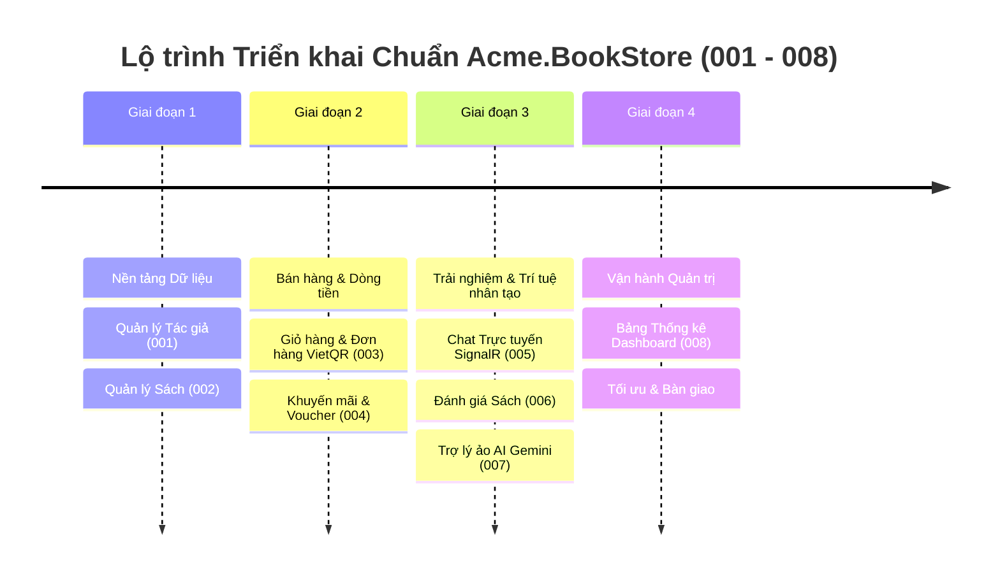

# 🗺️ Lộ Trình Phát Triển Sản Phẩm (Product Roadmap) - Acme.BookStore

> **Dự án**: Hệ thống Thương Mại Điện Tử Cửa Hàng Sách (Acme.BookStore)  
> **Kiến trúc công nghệ**: ASP.NET Core (ABP Framework v9.0) + Angular Signals (LeptonX Lite) + SQL Server  
> **Phương pháp quản lý**: Spec-Driven Development (SpecKit SDD)  
> **Trạng thái**: Hoàn thiện toàn bộ các tính năng cốt lõi (100% Core Features Completed)

---

## 🧭 Tổng quan Các Giai đoạn Triển khai (Milestones Timeline)



---

## 📋 Chi tiết Danh mục Tính năng theo Từng Giai đoạn

### 🔷 Giai đoạn 1: Nền tảng Cốt lõi & Danh mục Hàng hóa (Core Foundation)
*Mục tiêu: Xây dựng cơ sở dữ liệu hàng hóa, liên kết tác giả, nhà xuất bản, thể loại và quy chuẩn kiểm toán (Audit Logs).*

| Mã Spec | Tên Tính Năng | Mô tả Nghiệp vụ | Trạng thái | Tài liệu Đặc tả Chi tiết |
| :---: | :--- | :--- | :---: | :--- |
| **`001`** | **Quản lý Tác giả (Author Management)** | CRUD Tác giả, tiểu sử, ngày sinh, ràng buộc toàn vẹn dữ liệu khi xóa và API Lookup cho sách. | <span style="color:green">✅ Hoàn thành</span> | [specs/001-author-management/spec.md](specs/001-author-management/spec.md) |
| **`002`** | **Quản lý Sách (Book Management)** | Danh mục sách, phân trang, lọc đa tiêu chí, tính giá Flash Sale, kiểm tra tồn kho và giới hạn độ tuổi. | <span style="color:green">✅ Hoàn thành</span> | [specs/002-book-management/spec.md](specs/002-book-management/spec.md) |

---

### 🔷 Giai đoạn 2: Quy trình Bán hàng & Dòng tiền (Commerce & Checkout Flow)
*Mục tiêu: Xử lý giao dịch mua sắm, áp dụng khuyến mãi, thanh toán tự động và chu kỳ vòng đời đơn hàng.*

| Mã Spec | Tên Tính Năng | Mô tả Nghiệp vụ | Trạng thái | Tài liệu Đặc tả Chi tiết |
| :---: | :--- | :--- | :---: | :--- |
| **`003`** | **Giỏ hàng & Đặt hàng (Shopping Cart & Orders)** | Đồng bộ giỏ hàng thời gian thực qua Angular Signals Store, thanh toán VietQR động, luồng hủy đơn tự động hoàn kho/hoàn giỏ. | <span style="color:green">✅ Hoàn thành</span> | [specs/003-shopping-cart-orders/spec.md](specs/003-shopping-cart-orders/spec.md) |
| **`004`** | **Mã Giảm Giá & Khuyến Mãi (Coupons & Promotions)** | Quản lý voucher, chiết khấu % hoặc tiền mặt, kiểm tra trần giảm tối đa, đơn hàng tối thiểu và giới hạn 1 lần/khách. | <span style="color:green">✅ Hoàn thành</span> | [specs/004-coupons-promotions/spec.md](specs/004-coupons-promotions/spec.md) |

---

### 🔷 Giai đoạn 3: Tương tác Khách hàng & Ứng dụng AI (Customer Engagement & AI)
*Mục tiêu: Xây dựng cộng đồng độc giả, hỗ trợ khách hàng tức thì và tích hợp AI gợi ý sản phẩm thông minh.*

| Mã Spec | Tên Tính Năng | Mô tả Nghiệp vụ | Trạng thái | Tài liệu Đặc tả Chi tiết |
| :---: | :--- | :--- | :---: | :--- |
| **`005`** | **Hỗ trợ Chat Trực tuyến (Live Chat Support)** | Chat thời gian thực 2 chiều giữa Admin và Khách hàng qua SignalR Hub, đánh dấu tin nhắn đã đọc, gửi lời chào tự động. | <span style="color:green">✅ Hoàn thành</span> | [specs/005-live-chat-support/spec.md](specs/005-live-chat-support/spec.md) |
| **`006`** | **Đánh giá & Bình luận Sách (Book Reviews & Ratings)** | Chấm điểm 1-5 sao, viết nhận xét, thuật toán tự động gợi ý sách cùng tác giả/thể loại, trang kiểm duyệt cho Admin. | <span style="color:green">✅ Hoàn thành</span> | [specs/006-book-reviews/spec.md](specs/006-book-reviews/spec.md) |
| **`007`** | **Trợ lý ảo AI Gemini (AI Virtual Assistant)** | Tích hợp Google Gemini với kỹ thuật RAG nhúng kho sách thực tế, nhận diện độ tuổi độc giả, sinh thẻ mua sách trực tiếp trong chat. | <span style="color:green">✅ Hoàn thành</span> | [specs/007-chat-bot/spec.md](specs/007-chat-bot/spec.md) |

---

### 🔷 Giai đoạn 4: Vận hành Quản trị & Báo cáo Thông minh (Analytics & Operations)
*Mục tiêu: Giúp ban quản lý theo dõi sát sao tình hình kinh doanh, doanh số bán hàng và cơ cấu hàng tồn.*

| Mã Spec | Tên Tính Năng | Mô tả Nghiệp vụ | Trạng thái | Tài liệu Đặc tả Chi tiết |
| :---: | :--- | :--- | :---: | :--- |
| **`008`** | **Bảng Điều Khiển Quản Trị (Admin Analytics Dashboard)** | 4 thẻ chỉ số KPI kinh doanh, 3 biểu đồ trực quan (Doanh thu 12 tháng, Cơ cấu thể loại sách, Trạng thái đơn hàng) và popup lọc nhanh. | <span style="color:green">✅ Hoàn thành</span> | [specs/008-admin-dashboard/spec.md](specs/008-admin-dashboard/spec.md) |

---

## 🔄 Quy trình Phát triển Tính năng Chuẩn theo Roadmap (SpecKit SDD Lifecycle)

Khi tiếp tục mở rộng thêm các tính năng mới trong tương lai, hệ thống tuân thủ nghiêm ngặt chu trình 5 bước:

```text
┌────────────────┐     ┌────────────────┐     ┌────────────────┐     ┌────────────────┐     ┌────────────────┐
│ 1. Roadmap     │ ──> │ 2. Specify     │ ──> │ 3. Plan        │ ──> │ 4. Tasks       │ ──> │ 5. Implement   │
│ Thêm Feature   │     │ /speckit.      │     │ /speckit.      │     │ /speckit.      │     │ /speckit.      │
│ vào Roadmap.md │     │ specify        │     │ plan           │     │ tasks          │     │ implement      │
└────────────────┘     └────────────────┘     └────────────────┘     └────────────────┘     └────────────────┘
```
